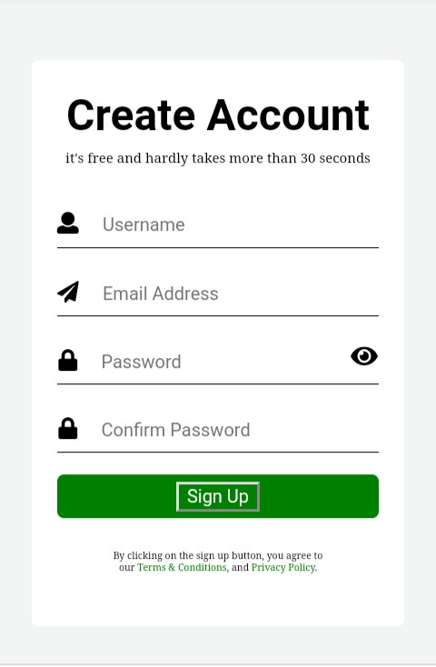

# Side Hustle internship level 4 task - Sign up form with validation solution

This is a solution to the 
Side hustle internship level 4 task. 

## Table of contents

- [Overview](#overview)
  - [The challenge](#the-challenge)
  - [Screenshot](#screenshot)
  - [Links](#links)
- [My process](#my-process)
  - [Built with](#built-with)
  - [What I learned](#what-i-learned)
  - [Useful resources](#useful-resources)
- [Author](#author)

## Overview

### The challenge

Users should be able to:

- Validate the input fields.
- Hide and show the password.

### Screenshot

### Links

- Solution URL: [Add solution URL here](https://your-solution-url.com)
- Live Site URL: [Add live site URL here](https://your-live-site-url.com)

## My process

### Built with

- Semantic HTML5 markup
- CSS custom properties
- Flexbox
- CSS Grid
- Mobile-first workflow
- vanilla javascript

### What I learned

- Learnt how to hide and show password input with JavaScript.
- How to validate email address with regex.

### Useful resources

- [Email validation with JavaScript](https://youtu.be/vPVx-zGFh0w) - This is an amazing article which helped me finally understand Email validation. I'd recommend it to anyone still learning this concept.

## Author

- Twitter - [@muslimahdev](https://www.twitter.com/muslimahdev)

